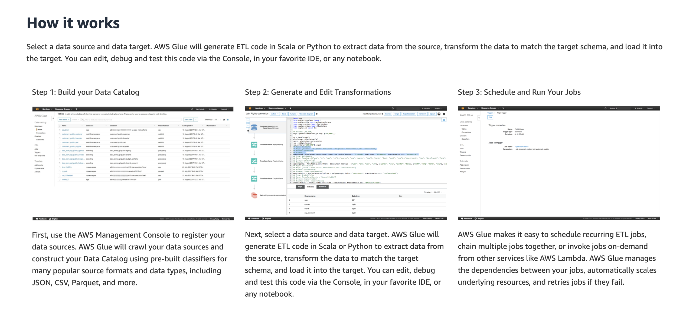
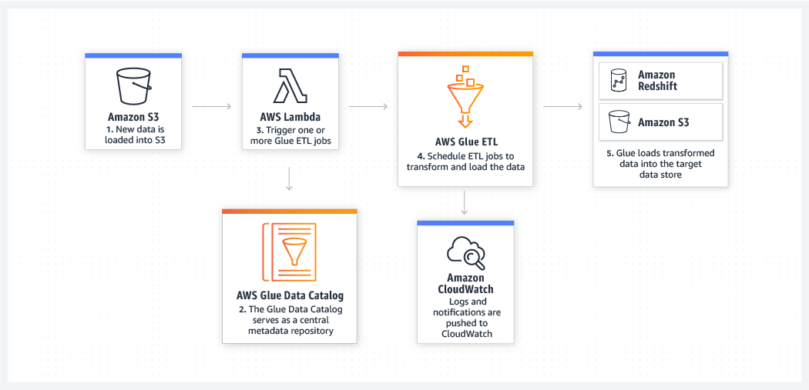

# AWS Glue
Simple, flexible, and cost-effective ETL

[Full docs here](https://aws.amazon.com/glue/)

* Fully managed ETL
* Create and run jobs with a few clicks
* Point Glue to data on AWS, the data is discovered and cataloged.
* Data is immediatly:
    * Searchable
    * Querably
    * Available for ETL
* Built on spark

## Benefits
* Less Hassle
    * Wide range of AWS services
    * Natively supports
        * Data in Amazon Aurora
        * All Amazon RDS engines
        * Amazon Redshift
        * Amazon S3
        * Common db engines in Virtual Private Cloud (Amazon VPC)
* Cost effective 
    * Serverless
    * Handles provisioning config
    * Handles scaling of the resources
* More power
    * Automates much of the effort of the following in jobs:
        * Building
        * Maintaining
        * Running etl jobs
    * Crawls data sources
    * Identifies data formats
    * Suggests schemas and transformations
    * AUto generates code to execute transformation and loading processes

## How it works

## Use Cases
### Queries against S3 data lake
If you want to build your own custom Amazon S3 data lake, AWS Glue can make all your data immediately available for analytics without moving the data

### Analyse log data in Data Warehouse
* Prep clickstream or process log data
    * Clean 
    * normalizing
    * Enriching
* Glue Generates:
    * the schema for semi-structured data
    * ETL code

### Unified view of data across multiple services.
Use Glue to discover data across multiple services, making the data immediatly queryable

### Event driven etl pipelines
Use an AWS Lambda function to trigger your ETL jobs to run as soon as new data becomes available in Amazon S3. You can also register this new dataset in the AWS Glue Data Catalog as part of your ETL jobs.

