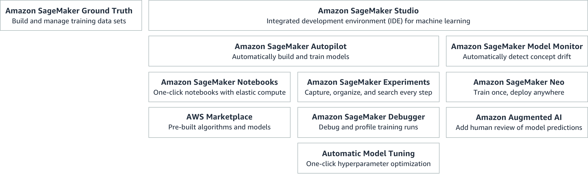

# SageMaker
[Full docs here](https://aws.amazon.com/sagemaker/)

* Fully managed
* Provides ability to do the following with ML models:
    * Build
    * Train 
    * Deploy

## Build machine learning models    
### SageMaker Studio
* Web based
* Visual interace
